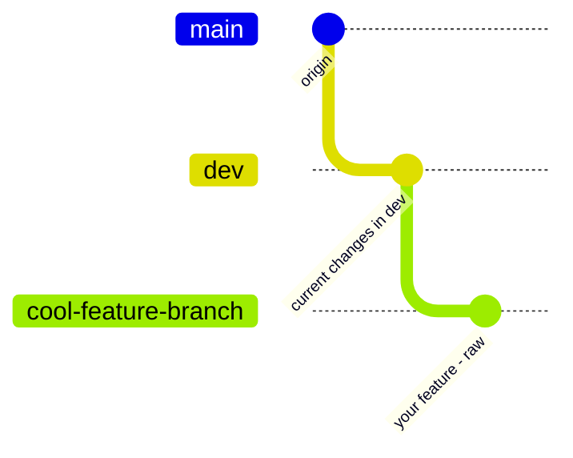
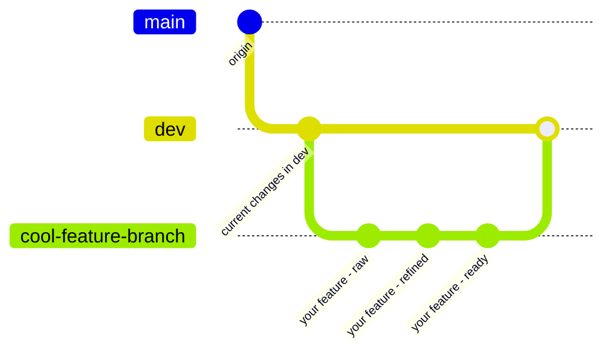
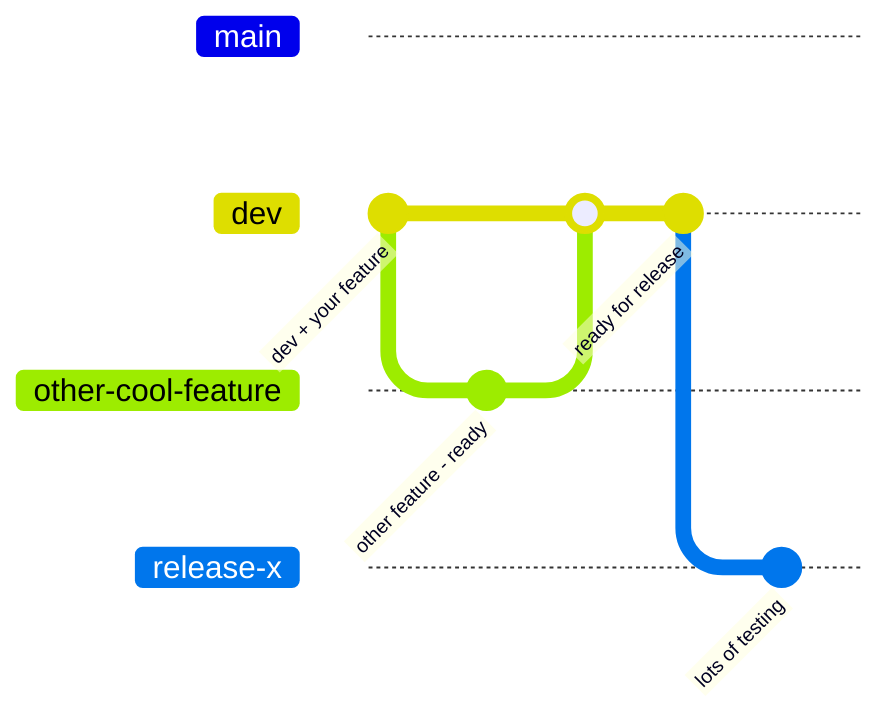
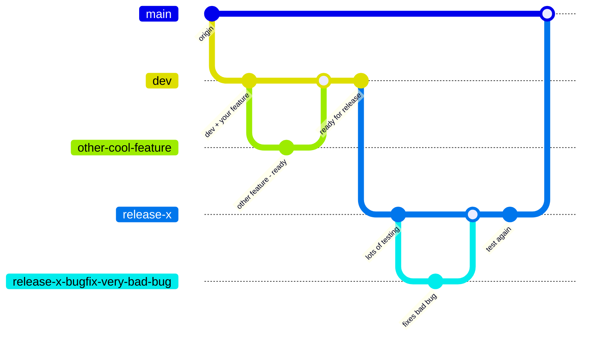

# Conventions for this Project

## Git branching strategy

### How and when to create branches 

We have two long-running branches:
- `main` - reflects production
- `dev` - staged for production

New featues should always be implemented in a new branch, created from `dev`:

Once you think the feature is ready, create a pull request to merge back into `dev`

Cool, the feature is now staged for production. Once enough new featues accumulate to justify a release, a release branch will be created from `dev` where extensive testing will take place:

After ensuring everything works, and potentially lots of bug fixes, the release will be merged into the main branch:

**For large features it might be better to even use sub-feature branches created from the feature branch.**

### Naming branches
- all lower case words
- devided by `-`

> example:
> `youtube-superchat-overlay`

## Eternal fight over naming things
#### Variables
Just use [camel-case](https://www.techtarget.com/whatis/definition/CamelCase#:~:text=CamelCase%20is%20a%20popular%20convention,naming%20conventions%20within%20an%20organization.)

#### Functions
- Use camel-case as well
- Normal Function start with a lower case letter
- React components start with an upper case letter

## Test / Code Coverage
- Write test in jest
- Try to cover as much as possible

